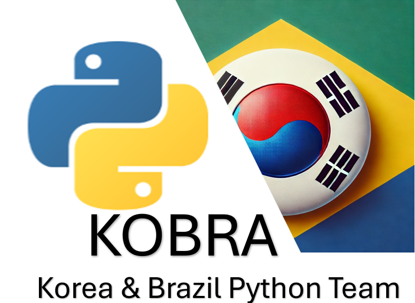

# Assesment2

  

## Subject: MSE-800 PSE-Professional Software Engineering
## Course: Master of Software Engineering - Yoobee Colleges

### Members: 
Eunseok Choi | 270597067@yoobeestudent.ac.nz  
Fabricio Mulato | 270516212@yoobeestudent.ac.nz

